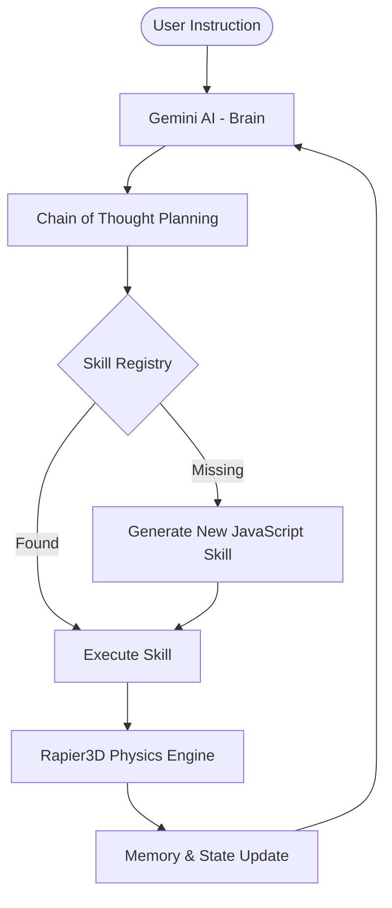

# 🤖 robotAiSim3D — CausalBot

An advanced, LLM-orchestrated 3D robotic simulation framework designed to explore autonomous reasoning, dynamic skill acquisition, and physics-based task execution in real-time.

## 🌌 Vision

To bridge the semantic gap between high-level human intent and low-level robotic control by leveraging the generative and reasoning capabilities of Large Language Models within a physically grounded 3D world.

**CausalBot** is more than just a 3D simulation; it is a "living" research environment where a robotic agent uses Large Language Models (LLMs) to bridge the gap between high-level natural language instructions and low-level physical actions. 

The core philosophy revolves around **Autonomous Reasoning (Chain of Thought)** and **Dynamic Skill Invention**. Instead of being hardcoded with Every possible action, the robot "thinks" through problems, plans its steps, and can even write its own JavaScript code to perform new tasks it hasn't seen before.

## 🎬 Demo

*(Screenshots and GIFs coming soon!)*

## 🧠 Key Features

- **Chain of Thought (CoT):** The robot mimics human reasoning by breaking down complex instructions into intermediate logical steps, visible in real-time within the UI. This allows for transparent debugging of the agent's thought process.
- **Dynamic Skill Invention:** When faced with a task beyond its current capability, the robot uses an LLM (Gemini) to generate and "invent" new JavaScript skills. These scripts are dynamically loaded, executed in the physics environment, and saved to a persistent **Skill Registry**.
- **Physics-Driven Execution:** Built with **Rapier3D**, the simulation ensures that every movement, collision, and object interaction follows realistic physical laws, providing high-fidelity feedback to the AI.
- **Memory & Feedback Loop:** Every action, success, and failure is logged in a **Memory Log**. The agent reflects on these logs to optimize its future planning and skill selection.
- **Premium 3D Visuals:** A sleek, dark-themed dashboard using **Three.js** with real-time status monitoring, dynamic lighting, and a responsive glassmorphic UI.

## 🏗️ Architecture



The project currently focuses on indoor navigation and basic object manipulation within a bounded 3D space:
- **Environment:** A 3x3 bounded room with floor physics and various interactable objects (balls, boxes, etc.).
- **Intelligence:** Integration with Gemini API for planning and code generation.
- **Control:** High-level navigation (A* / Pathfinding) and low-level physical control (Arm manipulation, rotation, jumping).

## 🎯 Expected Outcome

The ultimate goal of **robotAiSim3D** is to create a fully autonomous agent capable of:
1. **Self-Correction:** Understanding why a task failed through physics feedback and re-planning.
2. **Knowledge Persistence:** Building an extensive library of "invented" skills that grow more complex over time.
3. **Natural Interaction:** Serving as a bridge for humans to interact with complex robotic systems using simple, conversational language.

## 🛠️ Tech Stack

- **Frontend:** [Vite](https://vitejs.dev/) + Vanilla JavaScript
- **3D Engine:** [Three.js](https://threejs.org/) for high-performance WebGL rendering.
- **Physics Engine:** [Rapier3D](https://rapier.rs/) (Rust-based WASM physics) for deterministic rigid-body dynamics.
- **AI Integration:** [Google Gemini API](https://ai.google.dev/) (utilizing `gemini-2.5-flash` models).
- **Styling:** Custom CSS with Glassmorphism, CSS Variables, and CSS Grid/Flexbox for a premium dashboard feel.
- **State Management:** Reactive state patterns for real-time synchronization between the AI brain and the 3D scene.

## ⚙️ Getting Started

### Prerequisites
- Node.js (v18+)
- A Google Gemini API Key

### Installation

1. Clone the repository:
   ```bash
   git clone https://github.com/amarnath3003/robotAiSim3D.git
   ```
2. Navigate to the `causalbot` directory:
   ```bash
   cd causalbot
   ```
3. Install dependencies:
   ```bash
   npm install
   ```
4. Create a `.env` file in the `causalbot` folder and add your API key:
   ```env
   VITE_GEMINI_API_KEY=your_api_key_here
   ```
5. Run the development server:
   ```bash
   npm run dev
   ```

## 🤝 Contributing

Contributions are welcome! If you have ideas for new robot skills, environment improvements, or better LLM prompt strategies:

1. Fork the Project
2. Create your Feature Branch (`git checkout -b feature/AmazingFeature`)
3. Commit your Changes (`git commit -m 'Add some AmazingFeature'`)
4. Push to the Branch (`git push origin feature/AmazingFeature`)
5. Open a Pull Request

## 📜 License

Distributed under the MIT License. See `LICENSE` for more information.
